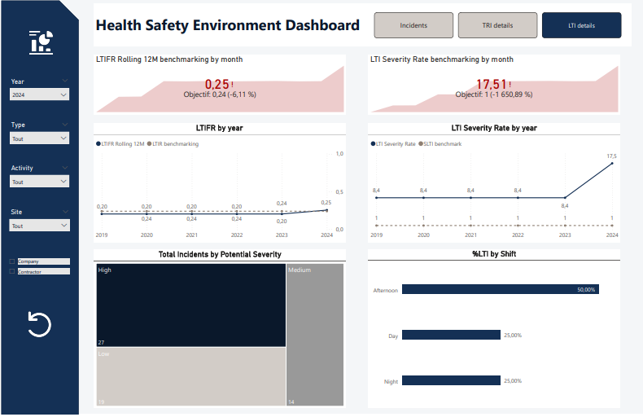

# 🦺 Health, Safety & Environment (HSE) Power BI Dashboard


## 📌 Project Overview

This repository contains a **professional Power BI HSE Dashboard** designed to analyze and monitor **Health, Safety, and Environment (HSE)** performance across multiple sites, activities, and companies.

The dashboard follows **industry-standard safety metrics** (TRI, LTI, TRIR, LTIFR) and uses a **star-schema data model** to ensure scalability, performance, and analytical depth.

It is suitable for:

* Corporate HSE reporting
* Executive & management reviews
* Contractor safety monitoring
* ESG & sustainability analytics

---

## 🎯 Business Objectives

* Monitor **incident performance** and exposure
* Track **safety trends over time** (monthly & cumulative)
* Compare performance by **site, activity, and company**
* Calculate **standardized safety rates** using man-hours
* Enable **Year-over-Year (YoY)** performance comparison
* Support data-driven HSE decision-making

---

## 📊 Key KPIs

| KPI                              | Description                          |
| -------------------------------- | ------------------------------------ |
| Total Incidents                  | All reported incidents               |
| Total Recordable Incidents (TRI) | OSHA / IOGP recordable incidents     |
| Lost Time Incidents (LTI)        | Incidents resulting in lost workdays |
| Total Man-Hours                  | Exposure basis for rate calculations |
| LTI Lost Days                    | Severity indicator                   |
| Days Since Last LTI              | Safety maturity metric               |

All major KPIs include **YoY % variation**.

---

## 🧭 Dashboard Pages

### 1️⃣ Incidents – Executive Overview


* KPI cards with YoY indicators
* Incidents by Site
* Recordable Incidents (TRI) by category
* Incidents by Type
* Monthly incidents with cumulative trend
* Days Since Last LTI

### 2️⃣ TRI Details


* TRIR Rolling 12 Months
* TRIR Year-To-Date
* Benchmark comparison
* Breakdown by site, activity, and company

### 3️⃣ LTI Details



* LTIFR Rolling 12 Months
* LTIFR Year-To-Date
* LTI Severity Rate
* Lost days analysis

---

## 🎛 Filters & Interactivity

The dashboard includes dynamic slicers:

* Year
* Incident Type
* Activity
* Site
* Company / Contractor

All visuals respond interactively to slicer selections.

---

## 🗂 Data Model

### 🔹 Architecture

* **Star Schema**
* Optimized for analytical performance
* Clear separation between facts and dimensions

### 🔹 Fact Tables

**fact_incident**

* Incident-level data
* Injury severity, recordability, lost days
* Linked to site, company, activity, equipment, body part

**fact_hours_worked**

* Total worked hours
* Used as exposure denominator

### 🔹 Dimension Tables

* dim_date
* dim_site
* dim_company
* dim_activity
* dim_employee
* dim_incident_type
* dim_incident_category
* dim_equipment
* dim_body_part

---

## 🧮 Key DAX Measures (Samples)

```DAX
Total Incidents = COUNT(fact_incident[Incident_ID])
```

```DAX
TRIR =
DIVIDE(
    [Total Recordable Incidents] * 1000000,
    [Total Man-Hours]
)
```

```DAX
LTIFR =
DIVIDE(
    [Total Lost Time Incidents] * 1000000,
    [Total Man-Hours]
)
```

Additional measures include:

* Rolling 12 Months (TRIR / LTIFR)
* Year-To-Date metrics
* YoY % change
* Cumulative incidents
* Days Since Last LTI

---

## 📐 Benchmarks & Standards

* Industry benchmarks (e.g. IOGP)
* Internal corporate targets
* Performance comparison integrated into TRI & LTI pages

---

## 🎨 Design Principles

* Executive-friendly layout
* Clean and consistent color palette
* High readability for management reporting
* Logical navigation using buttons
* Minimal clutter, insight-focused visuals

---

## 🛠 Tools & Technologies

* Power BI Desktop
* DAX
* Power Query
* Star schema modeling

---

## 🚀 Potential Enhancements

* Predictive safety analytics
* Near-miss & safety observations module
* Automated data refresh

---

## 👤 Author

**Meryem KACEM**
Business Data Analytics Professional
Power BI • DAX • Data Modeling • Safety Analytics

🔗 *This project is part of a professional analytics portfolio.*

---

⭐ If you find this project useful, feel free to star the repository.
